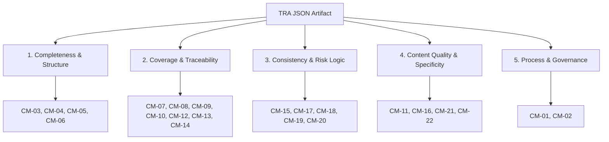

# Automated Quality Assessment & Metrics Toolkit for Threat and Risk Analysis (TRA)

> **Master's Thesis Project**  
> **Author:** Arshathul Mohamed Haq Bahadur Ibrahim Khalifullah  
> **Topic:** Automated, Deterministic Quality Evaluation, Metric Framework, and Architecture Alignment for Threat & Risk Analysis in Cyber-Physical and Software Systems.

---

## 1. Master's Thesis Overview

### 1.1 Context & Motivation
Threat and Risk Analysis (TRA) is a foundational pillar in security engineering for industrial cyber-physical systems (CPS) and software architectures, underpinning standards such as **IEC 62443** (industrial automation and control systems security) and **ISO/SAE 21434** (automotive cybersecurity). 

A TRA systematically records assets, security zones, logical interfaces, communication links, protection goals, threat scenarios, and risk treatment decisions. The quality, completeness, and rigor of this artifact directly dictate how effectively engineering teams can identify vulnerabilities and implement justifiable safeguards.

### 1.2 Problem Statement
Historically, assessing the quality and fidelity of a TRA has relied almost exclusively on **manual expert reviews**. This traditional paradigm suffers from major deficiencies:
- **Subjectivity & Human Variance:** Different reviewers evaluate completeness and risk consistency against disparate qualitative benchmarks.
- **High Resource Cost & Bottlenecks:** Thorough manual audits are labor-intensive, creating bottlenecks that impede rapid agile development and continuous system engineering.
- **Common Latent Model Defects:** In practice, industrial TRAs frequently suffer from:
  - Missing architectural components or unmapped logical interfaces.
  - Orphaned assets without assigned protection goals.
  - Placeholder, boilerplate, or whitespace-dominated text entries (`TBD`, `TODO`, `N/A`).
  - Inconsistent pre- vs. post-mitigation risk ratings violating standard risk matrices.
  - Unaligned risk treatment workflows (e.g., accepted risks without mitigation progress).
  - Redundant or near-duplicate threat scenarios inflating artifact size without adding coverage.

### 1.3 Core Research Objectives & Contributions
This master's thesis formulates an **automated, deterministic quality assessment framework** that analyzes structured TRA JSON models locally and objectively, without relying on non-deterministic AI/LLMs or cloud services for core quality scoring.

Key contributions of the thesis:
1. **Formal TRA Quality Metric Catalog:** A standardized, comprehensive framework defining **22 Core Metrics (`CM-01` through `CM-22`)** categorized into five quality dimensions.
2. **Deterministic Evaluation Engine ([src/tra_quality_report.py](src/tra_quality_report.py)):** A standalone Python engine providing zero-cloud, repeatable quality scoring, JSON path evidence tracing, and rich report generation.
3. **Dual Reporting Artifacts:** Simultaneous generation of an interactive **HTML executive dashboard** (traffic-light scorecards and expandable diagnostics) and **machine-readable JSON metrics** for CI/CD integration.
4. **Architecture-to-Model Alignment ([src/drawio_tool.py](src/drawio_tool.py)):** An asymmetric graph-matching utility that parses visual architecture diagrams (draw.io XML) and cross-checks them against TRA components and communications to flag unmodeled architectural elements.
5. **Empirical Benchmark & Mutation Validation:** A reproducible validation study using a **Secure Water Treatment (SWaT / MiniCPS)** testbed simulation (`MiniCPS_Evaluation/`) to systematically demonstrate high detector precision, recall, and threshold stability under injected defects.

---

## 2. Quality Dimensions & Core Metric Catalog

The evaluation framework scores a TRA across five fundamental quality dimensions:



### Dimension Summary

| Dimension | Scope & Objectives | Key Metrics |
|---|---|---|
| **1. Completeness & Structure** | Structural integrity, mandatory top-level sections, validated assumptions, and security zone exposure consistency. | `CM-03` Mandatory sections<br>`CM-04` Placeholder & whitespace detection<br>`CM-05` Assumption validation ratio<br>`CM-06` Zone exposure & interface mapping |
| **2. Coverage & Traceability** | Bidirectional traceability across assets, protection goals, threats, logical interfaces, and communication paths. | `CM-07` Interface coverage by threats<br>`CM-08` External interface coverage<br>`CM-09` Communication coverage<br>`CM-10` Asset-to-component mapping<br>`CM-12` Out-of-scope justification<br>`CM-13` No-threat red flag<br>`CM-14` Asset coverage in protection goals |
| **3. Consistency & Risk Logic** | Mathematical coherence of risk ratings, matrix alignment, treatment progress, and C/I/A protection goal balance. | `CM-15` Protection-goal C/I/A balance<br>`CM-17` Rating coherence & justification<br>`CM-18` Risk-treatment workflow alignment<br>`CM-19` Rating distribution / rubber-stamping detector<br>`CM-20` Assumption usage & linkage |
| **4. Content Quality & Specificity** | Threat naming precision, avoidance of vague descriptions, semantic completeness, and non-redundancy. | `CM-11` Documentation clarity (system & components)<br>`CM-16` Context-scoped near-duplicate threats<br>`CM-21` Threat-structure completeness (semantic)<br>`CM-22` Vagueness & imprecision reduction |
| **5. Process & Governance** | Multi-stakeholder engagement, workshop quorum, moderator presence, and timeline maintenance. | `CM-01` Workshop participation threshold<br>`CM-02` Lifecycle & update responsiveness |

*For complete metric formulas and threshold definitions, see [docs/TRA_Quality_Metrics_Catalog.xlsx](docs/TRA_Quality_Metrics_Catalog.xlsx) and the thesis PDF in [docs/](docs/).*

---

## 3. Version Lineage & Refinements (v0.1 Thesis Baseline vs. v0.2 Post-Thesis Cycle)

> **Important Scope Distinction**:
> - **Version 0.1 (Thesis Baseline)** represents the original research, initial metric catalog, and empirical benchmark evaluation submitted and defended as part of the Master's Thesis (see [docs/200494_BahadurIbrahimKhalifullah_ArshathulMohamedHaq_MA-Thesis.pdf](docs/200494_BahadurIbrahimKhalifullah_ArshathulMohamedHaq_MA-Thesis.pdf)).
> - **Version 0.2 (Post-Thesis Refinement Cycle)** is **not part of the original thesis submission**. It represents a subsequent engineering, validation, and calibration cycle conducted post-thesis to harden heuristics against real-world edge cases, eliminate false positives, consolidate metrics, and add architecture diagram alignment.

The full audit log of all changes made during the post-thesis refinement cycle is recorded in **[docs/REFINEMENT_LOG.md](docs/REFINEMENT_LOG.md)**. Below is an executive summary:

### 3.1 Metric Catalog Restructuring & Renumbering (`CM-01..CM-22`)
- **Metric Consolidation:** Merged legacy system-overview presence (`CM-11`) and component scope clarity (`CM-13`) into a single unified metric: **`CM-11 Documentation Clarity`**, which evaluates both qualitative narrative depth and external documentation references (such as arc42 links).
- **Sequential Indexing:** Renumbered the catalog to a clean, continuous sequence of 22 active core metrics (`CM-01` through `CM-22`).

### 3.2 Enhanced Heuristics & False-Positive Elimination
- **Strict Whitespace Detection (`CM-04`):** Upgraded placeholder scans to catch empty newline/whitespace strings (`WHITESPACE_ONLY`) and report exact JSON field paths for rapid author remediation.
- **Scope-Aware Zone & Exposure Checking (`CM-06`):** Deduplicated zone findings, constrained checks strictly to evaluable interface types modeled in scope (e.g. avoiding false warnings for unmodeled host interfaces), and unified diagnostic evidence formatting.
- **Context-Scoped Near-Duplicate Detection (`CM-16`):** Scoped pairwise Jaccard text similarity checks to the *same component/interface*, preventing false positive duplicate flags across independent subsystems.
- **Rigorous Risk-Treatment Workflow Logic (`CM-18`):** Verified valid status transitions against concrete expectations:
  - *Accepted risks* require low/acceptable post-mitigation ratings or explicit avoidance notes.
  - *In-progress mitigations* must reflect mapped mitigation actions.
  - Per-threat diagnostic outputs clearly show `Expected` vs `Actual` states.
- **Calibrated Discrimination Detector (`CM-19`):** Replaced naive uniform-distribution assumptions with an *input-diversity guarded concentration model*, ensuring legitimate, well-justified Moderate-heavy portfolios are not unfairly penalized.

### 3.3 Visual Architecture Alignment
- Integrated **[src/drawio_tool.py](src/drawio_tool.py)** with an asymmetric rule: missing draw.io nodes or communication links in the TRA are flagged as actionable gaps, while supplemental TRA units not in the diagram are preserved as valid context. See [docs/SystemArchitectureLLMAssisted.md](docs/SystemArchitectureLLMAssisted.md).

---

## 4. Quick Start & Execution Guide

### 4.1 Prerequisites
- **Python 3.10+**
- The core scoring engine ([src/tra_quality_report.py](src/tra_quality_report.py)) uses **standard-library modules only** (`argparse`, `json`, `re`, `math`, `html`, `os`, `sys`). No third-party packages are required for basic execution.

### 4.2 Running Quality Analysis

Execute the tool against any target TRA JSON export:

```powershell
# Basic execution (generates <input>_quality_report.html and <input>_quality_metrics.json)
python src\tra_quality_report.py path\to\your_tra.json

# Explicit custom output paths
python src\tra_quality_report.py path\to\your_tra.json `
    --html-out reports\quality_dashboard.html `
    --metrics-out reports\quality_metrics.json
```

### 4.3 Architecture Alignment Analysis (Optional)

Extract and compare an architectural diagram against a TRA model:

```powershell
# Extract structural nodes and links from a draw.io diagram
python src\drawio_tool.py parse path\to\architecture.drawio --json-out arch.json

# Cross-reference diagram elements with TRA model
python src\drawio_tool.py align path\to\architecture.drawio path\to\your_tra.json
```

---

## 5. Repository Structure

```text
├── src/                               # Core tool source code (v0.2 engine)
│   ├── tra_quality_report.py          # Primary deterministic evaluation engine
│   └── drawio_tool.py                 # draw.io architecture diagram extraction & alignment tool
├── README.md                          # Master's thesis & toolkit documentation
├── docs/                              # Thesis report, presentations, logs, and metric catalogs
│   ├── 200494_BahadurIbrahimKhalifullah_ArshathulMohamedHaq_MA-Thesis.pdf
│   ├── REFINEMENT_LOG.md              # Comprehensive audit trail of metric refinements (v0.1 -> v0.2)
│   ├── SystemArchitectureLLMAssisted.md # Architecture alignment methodology
│   ├── TRA_Quality_Metrics_Catalog.xlsx
│   └── TRA_Quality_Scoring_Presentation.pdf
├── MiniCPS_Evaluation/                # Thesis benchmark case study (SWaT water treatment)
│   ├── tra/                           # Benchmark models (minicps_swat_tra.json)
│   ├── run_mutation_experiment.py     # Defect mutation evaluation harness
│   ├── run_sensitivity_analysis.py    # Threshold sensitivity testing suite
│   └── results/                       # Empirical matrices, graphs, and precision/recall data
├── examples/                          # Reference sample outputs (HTML dashboard and JSON metrics)
│   ├── sample_quality_report.html
│   └── sample_quality_metrics.json
├── tests/                             # Unit tests, regression suites, and validation scripts
└── requirements-dev.txt               # Optional packages for chart generation and evaluation scripts
```

---

## 6. Reproducible Benchmark Evaluation (MiniCPS / SWaT)

The thesis evaluation is fully reproducible using the public **Secure Water Treatment (SWaT / MiniCPS)** six-stage industrial water treatment testbed model located in `MiniCPS_Evaluation/tra/minicps_swat_tra.json`.

### Step 1: Score the Reference Benchmark
```powershell
python src\tra_quality_report.py MiniCPS_Evaluation\tra\minicps_swat_tra.json `
    --html-out examples\sample_quality_report.html `
    --metrics-out examples\sample_quality_metrics.json
```

### Step 2: Run the Controlled Defect Mutation Experiment
```powershell
# Optional: install development dependencies for graph plotting
pip install -r requirements-dev.txt

# Run the 13-variant mutation experiment (V1..V13)
python MiniCPS_Evaluation\run_mutation_experiment.py
```
This experiment injects isolated, controlled defects across structural, coverage, consistency, and content fields to validate detector precision, recall, and F1 scores (persisted in `MiniCPS_Evaluation/results/`).

### Step 3: Run the Threshold Sensitivity Analysis
```powershell
python MiniCPS_Evaluation\run_sensitivity_analysis.py
```
Evaluates scoring stability across clean (`V0`), moderately degraded (`V4`), and heavily degraded (`V2`) models under varying threshold configurations.

---

## 7. Export & Privacy Statement

This repository is maintained in an export-safe state:
- **Clean Academic Core:** Contains only the general evaluation engine, public testbed models, sanitized documentation, and synthetic benchmark datasets.
- **Zero Confidential Artifacts:** All internal corporate identifiers, proprietary threat databases, customer project names, and confidential spreadsheet workbooks have been excluded or placed under `.gitignore` (`_private/`, `*.xlsm`, `*.tmp`).

---

## 8. Calibration Constants & Threshold Defaults

Key heuristic constants are defined in [src/tra_quality_report.py](src/tra_quality_report.py):

- `KEYWORD_ONLY_MIN_WORDS = 6`
- `OVERVIEW_MIN_WORDS = 20`
- `SCOPE_DESC_MIN_WORDS = 5`
- `JACCARD_DUP_THRESHOLD = 0.6`
- `SPECIFICITY_PASS_THRESHOLD = 0.65`
- `CONCRETE_STRENGTH_MIN = 1.0`
- `CONCRETE_MIN_TERMS = 2`

These thresholds can be systematically evaluated or calibrated against custom labeled corpora via the `--calibrate-thresholds` flag.
